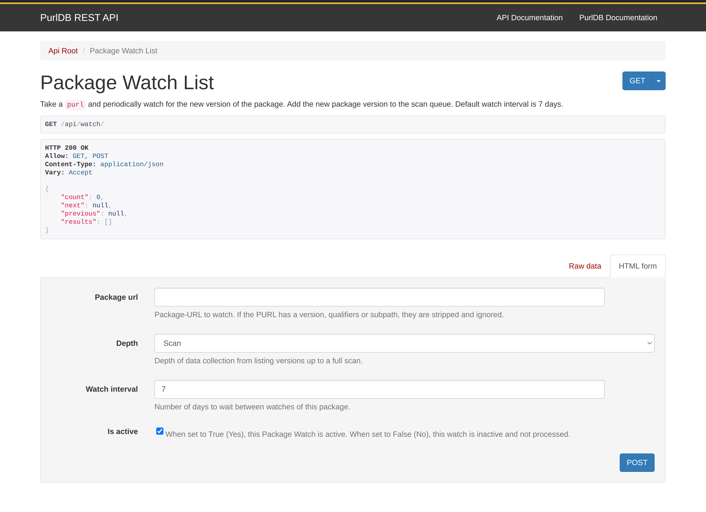

.. _purl_watch_how_to:

==========================
Watch PURL for new Version
==========================

In this guide we will show how to use the PurlWatch to keep the
PurlDB up-to-date with new version of packages.

Using Package Watch Command
---------------------------

To keep a small and focused PurlDB up-to-date, run the
following management command on a periodic basis:

   .. code-block:: bash

        python manage_purldb.py watch_packages

   This command checks all PURLs in your PurlDB for new versions and indexes them accordingly.

Using the Watch API Endpoint
----------------------------

For larger PurlDB, the `/api/watch` endpoint is much efficient way to keep PurlDB up-to-date.

Here's how to use it:

Adding a New Watch
~~~~~~~~~~~~~~~~~~

To add a new watch for a PURL:

Send a POST request to ``/api/watch`` with the following payload:

    .. code-block:: json

       {
           "package_url": "<versionless PURL>",
           "depth": 3,  // 1 for version only, 2 for metadata, 3 for full scan (currently all PURLs are fully scanned)
           "watch_interval": 7,  // How frequently check for new versions (default = 7 days)
           "is_active": true  // Whether the watch is active (default = true)
       }

Modifying an Existing Watch
~~~~~~~~~~~~~~~~~~~~~~~~~~~

To modify an existing watch:

Send a POST request to ``/api/watch/<package-url>`` with the updated payload:

   .. code-block:: json

       {
           "depth": 3,  // Update depth if needed
           "watch_interval": 7,  // Update watch interval if needed
           "is_active": true  // Update activity status if needed
       }

Using the DRF Browsable API
---------------------------

For one-off or testing purposes, you can use the DRF Browsable
API to interact with the ``/api/watch`` endpoint:

